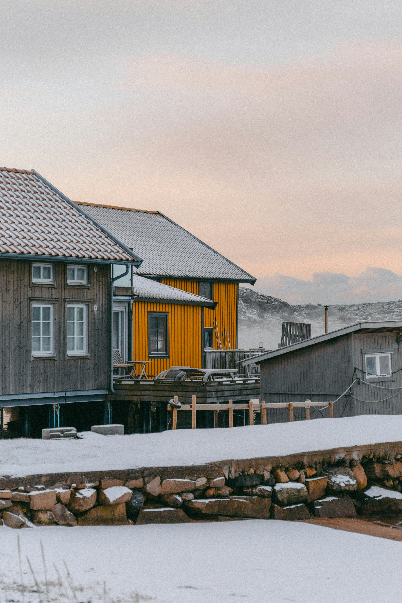
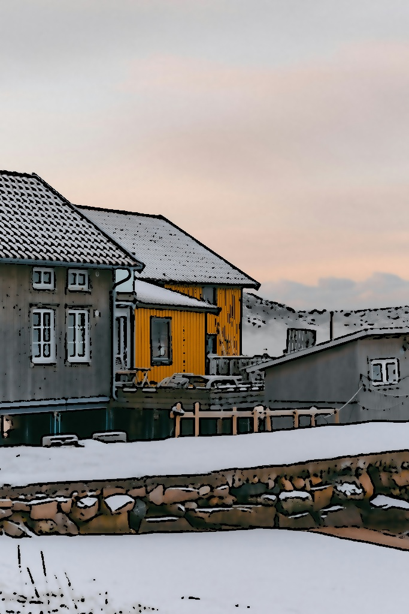

# Cartoon_Converter
카툰 풍 이미지 변환기

# 개요
간단한 절차를 통해 이미지를 카툰 풍으로 변환해주는 프로그램입니다.

# 사용법
1. `data/image` 폴더에 1.jpg이라는 이름의 이미지를 넣습니다.
2. 프로그램을 실행하면 변환된 결과가 보여집니다.
3. 결과가 마음에 든다면 's'키를 눌러 이미지를 `data/image/1_output.jpg`에 저장합니다. 그렇지 않다면 그 외의 키를 눌러 프로그램을 종료합니다.

# 변환 예시
## 좋은 예

## 나쁜 예

# 한계점
- 사용하는 필터가 고정 크기를 사용하므로 이미지의 크기에 영향을 크게 받습니다.
 - 이미지 크기가 1024x1024 이상일 경우 1024x1024까지 축소됩니다.
- 세세한 묘사가 너무 많거나 적으면 잘 작동하지 않습니다.
 - bad.jpg의 사람과 산이 각각의 예시입니다.

# data/image 출처
1.jpg - 직접 제작
 
good.jpg, good_output.jpg - https://unsplash.com/ko/%EC%82%AC%EC%A7%84/%EB%88%88-%EC%86%8D%EC%97%90-%EC%9E%88%EB%8A%94-%EB%91%90-%EC%B1%84%EC%9D%98-%EC%A7%91-5bze5kVrfAU
 
bad.jpg, bad_output.jpg - https://unsplash.com/ko/%EC%82%AC%EC%A7%84/%EC%82%B0-%EA%BC%AD%EB%8C%80%EA%B8%B0%EC%97%90-%EC%84%9C-%EC%9E%88%EB%8A%94-%EC%82%AC%EB%9E%8C-nMzbnMzMjYU